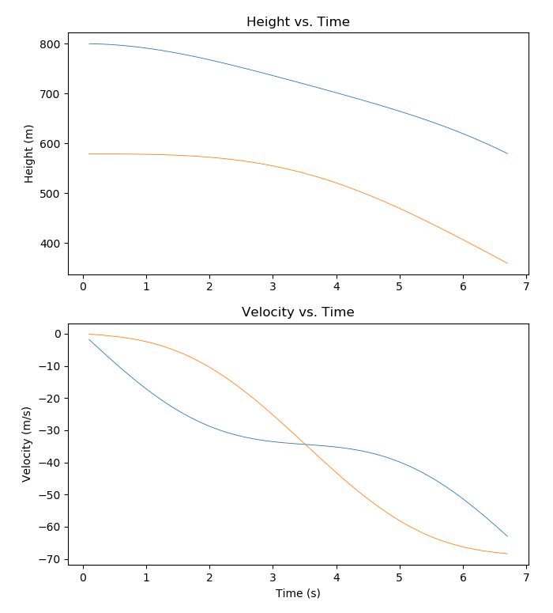
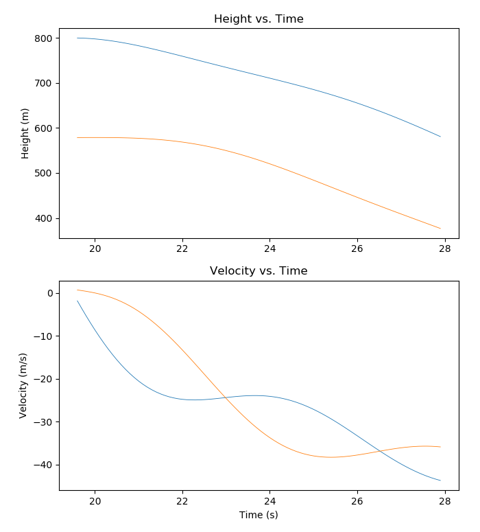
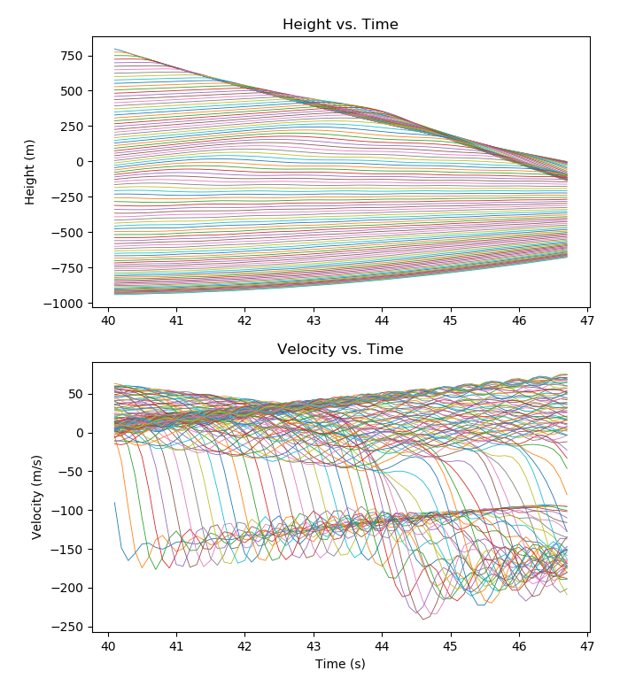

- Sheron Balasingam

10/10/2017CSCI 3010U Assignment 1 Report

- I tested out the following scenarios and output velocity vs time and height vs time graphs for them. The

- graphs recorded the height and velocities for when the slinky was released to when the top of the slinky

- passed the rest position of the bottom of the slinky:
 dfdf                                        |  dfdfd
---------------------------------------------|--------------------------------------------
2 mass, 1 spring:                            | 
When held:                                   |
o  Bottom of slinky kept moving up and down because energy is conserved |
 |
- -  When let go: |
o  The bottom of the slinky did start to move slowly and moved faster as the top of the slinky got closer |
 |
- 2 mass, 1 spring + damper: |
- -  When held: |
o  Bottom of slinky moved up and down but slowed down with each movement |
 | 
- -  When let go: |
o  The bottom of the slinky did not move right away, but when the top got close, it started to move, but would slow down and allow the top to catch up again. This was repeated a few times. |

10/10/2017- Sheron Balasingam

- n mass, n-1 spring (where n = 100):
- -  When held:
o  The masses throughout the whole slinky kept bouncing through like a wave which resembled a real slinky, but since there was no damper, the waves kept going.

- -  When let go:
o  The weights would keep accelerating and decelerating just like a wave. The bottom of the slinky did not start to move until the top was close.

- n mass, n-1 spring  + damper (where n = 100):
- -  When held:
o  The masses throughout the whole slinky kept bouncing through like a wave which resembled a real slinky and even came to rest like the one in the video

- -  When let go:
o  From the graph, you can see that the bottom of the slinky is at rest through the whole graph. It did not move until after the top reached the bottom.

- In conclusion, the n mass n-1 spring + damper most closely simulated a slinky.

